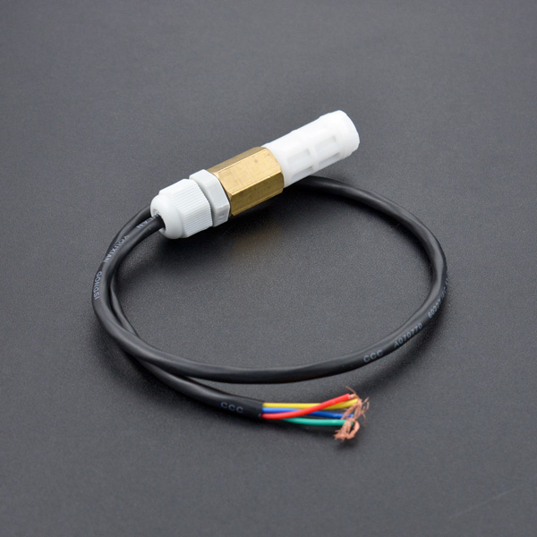

# DFRobot_SHT20
* [中文版](./README_CN.md)

This is a SHT20 I2C temperature & humidity sensor with waterproof probe.
It comes with the 4C CMOSens® SHT20 temperature & humidity sensor chip, and the probe has gone through dual waterproof protection.
The SHT20 I2C temperature & humidity sensor adopt Sensirion new technique.
Besides the capacitive type humidity sensor and the band gap temperature sensor, the chip contains an amplifier, A/D converter, OTP memory and a digital processing unit.
To compare with early SHT1x series and SHT7x series, SHT20 shows better reliability and long-term stability.
It can measure surrounding environment temperature and relative air humidity precisely.




## Product Link (https://www.dfrobot.com/product-1636.html)
    SKU: SEN0227


## Table of Contents

* [Summary](#summary)
* [Installation](#installation)
* [Methods](#methods)
* [Compatibility](#compatibility)
* [History](#history)
* [Credits](#credits)


## Summary

* The Arduino SHT20 waterproof temperature & humidity sensor adopts dual waterproof protection.
* The inner PCB has perfusion and encapsulation protection, and the probe enclosure is made of PE waterproof materials.
* This is a special waterproof breathable material that allows water molecules to seep in, blocking water droplets from seeping in.
* The sensor won't be damaged even if it is submerged in water for a long time.
* There is a built-in 10k Pull-up resistor and 0.1uf filter capacitor, so It can be used directly with the microcontroller such as Arduino.
* Recommend DFRobot Gravity 4Pin Sensor Adapter, it is quite convenient.


## Installation

To use the library, first download the library file, paste it into the directory you specified, then open the Examples folder and run the demo in that folder.


## Methods

```python

  '''!
    @brief 读取空气湿度测量数据
    @return 返回float类型的空气湿度测量数据, 单位: %
  '''
  @property
  def read_humidity(self):

  '''!
    @brief 读取温度测量数据
    @return 返回float类型的温度测量数据, 单位: C
  '''
  @property
  def read_temperature(self):

  '''!
    @brief 检测SHT20当前状态信息
    @n 状态信息包括: End of battery, Heater enabled, Disable OTP reload
    @n 检测结果包括: yes, no
  '''
  @property
  def check_SHT20(self):

```


## Compatibility

* RaspberryPi Version

| Board        | Work Well | Work Wrong | Untested | Remarks |
| ------------ | :-------: | :--------: | :------: | ------- |
| RaspberryPi2 |           |            |    √     |         |
| RaspberryPi3 |           |            |    √     |         |
| RaspberryPi4 |     √     |            |          |         |

* Python Version

| Python  | Work Well | Work Wrong | Untested | Remarks |
| ------- | :-------: | :--------: | :------: | ------- |
| Python2 |     √     |            |          |         |
| Python3 |     √     |            |          |         |


## History

- 2021/12/03 - Version 1.0.0 released.


## Credits

Written by qsjhyy(yihuan.huang@dfrobot.com), 2021. (Welcome to our [website](https://www.dfrobot.com/))

